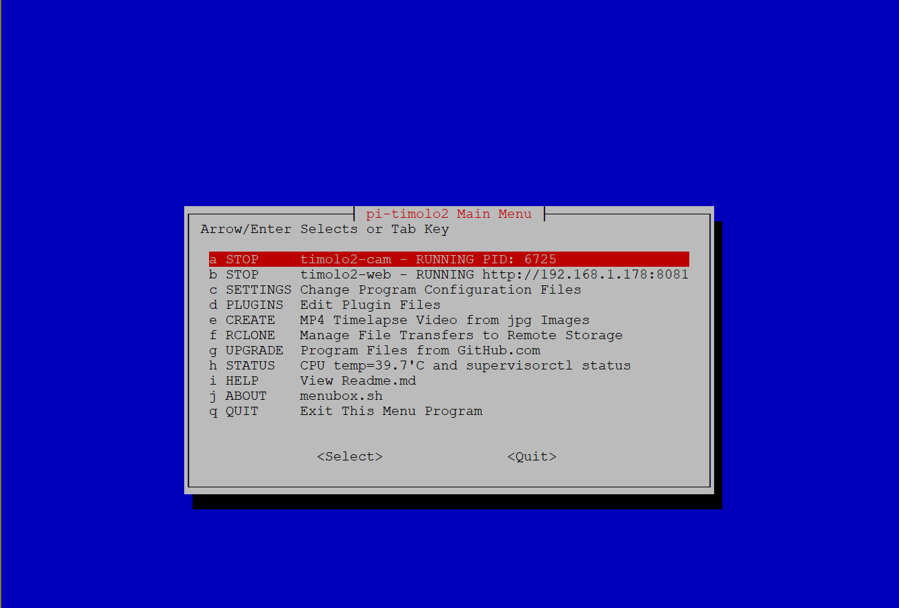

# PI-TIMOLO2 
### Raspberry (Pi)camera2, (Ti)melapse, (Mo)tion, (Lo)wlight
Also PanTilt Pano Image Stiching, PanTilt Sequence, Video Repeat, Quick Timelapse, Plugins, RClone Sync Folder Upload, Etc.

## Quick Install or Upgrade
**IMPORTANT** - It is suggested to run ***sudo apt-get update*** and ***sudo apt-get upgrade***
before performing curl install, since it is **Not** performed by the ***timolo2-install.sh*** script

Internet access is Required. Login to Raspberry Pi via ssh or locally with a terminal session open. In user home folder eg /home/pi 

##### Step 1
Press GitHub copy icon on right side of code box below. Copied! will be displayed.                

    curl -L https://raw.github.com/pageauc/pi-timolo2/master/source/timolo2-install.sh | bash

##### Step 2
On RPI putty SSH or local terminal session, right click, select paste then Enter to download and run install script.  

The curl command will download and Run the GitHub [***timolo2-install.sh***](https://github.com/pageauc/pi-timolo2/blob/main/source/timolo2-install.sh) script. 
An upgrade will not overwrite configuration files. Brief instructions are displayed at the end of the install.

## Introduction
PI-TIMOLO2 is primarily designed for ***headless operation*** and includes rclone that
can securely synchronize specified media folders and files with a users remote storage service of choice. This works well for remote security and monitoring
cameras. Low Light uses a different algorithm based on a video stream thread frame px average below ***DARK_START_PXAVE*** per config.py setting.

It runs using libcamera and picamera2 python library, Bullseye (libcamera config), Bookworm Raspberry Pi OS and later.
This release points to original pi-timolo wiki that may sometimes not be relavent to pi-timolo2 features.

pi-timolo2 uses supervisor to launch timolo2-cam.py or timolo2-web.py in background.
Use timolo2.sh, webserver.sh to manage (see help eg ***./timolo2.sh help***)
or menubox.sh when supervisor processes installed.   

Python scripts use python3 only and can take timelapse and/or motion tracking images/videos, separately or together. Will take
long exposure Night/Dark (lowlight) images for Time Lapse and/or Motion. Customization settings are saved in a [***config.py***](https://github.com/pageauc/pi-timolo2/blob/main/source/config.py) ,
conf files and optional special purpose plugin config files located in the ***plugins*** folder. 
Optional plugin feature allows overlaying config.py settings with custom settings for specific tasks.  

Includes ***makevideo.sh*** to create timelapse or motion lapse videos from images. Use webserver to
view images or videos. ***menubox.sh*** can admin settings and stop start, timolo2.cam.py and timolo2-web.py as background tasks. 
       
For more Details see [Github Wiki](https://github.com/pageauc/pi-timolo/wiki)   
***Note:*** This points to original pi-timolo and some information might not be relavent or wrong for pi-timolo2
A basic (simplified) lolight timelapse project can be found at https://github.com/pageauc/lolight
This was used for code testing as part of pi-timolo upgrade.

Github Issues are welcome.

## Instructions

Requires a [***Raspberry Pi computer***](https://www.raspberrypi.org/documentation/setup/) and a 
[***RPI camera module installed***](https://www.raspberrypi.org/documentation/usage/camera/).
Make sure hardware is tested and works. Most [RPI models](https://www.raspberrypi.org/products/) will work OK. 
A quad core RPI will greatly improve performance due to threading. 

You must have a recent version of Raspberry Pi OS. Bullseye, Bookworm or later 32 or 64 bit. Optional pantilt eg Pimoroni pantilt Hat.
This supports pano stitching mode, pantilt sequence on motion or timelapse sequences.

1 - If config.py, makevideo.sh already exists then latest file will be a .new appended to the file name

2 - If using Bulleye run sudo raspi-config, Interface Options, 3. 
    Make sure camera is NOT in Legacy picamera mode. Test camera. See commands below
	
	sudo raspi-config              % Check System Options Bullseye Only
	libcamera-hello --list-cameras 
	libcamera-still -o sample.jpg  # you should see file if camera is working OK

3 - You will need to create symlinks to enable supervisorctl operation per below.
	This will allow proper operation of menubox.sh START/STOP menu picks.
	See Details at [supervisor Readme.md](https://raw.githubusercontent.com/pageauc/pi-timolo2/refs/heads/main/source/supervisor/)

    cd ~/pi-timolo2
    ./timolo2-cam.sh install  # installs symlink for supervisorctl
    ./timolo2-web.sh install
    
    ./timolo2-cam.sh help     # Display other options
	
4 - To Test Run timolo2 execute the following commands in RPI SSH
    or terminal session. Default is Motion Track On and TimeLapse On

    cd ~/pi-timolo2
    ./timolo2-cam.py

5 - To manage pi-timolo2, Run menubox.sh per commands below

    cd ~/pi-timolo2
    ./menubox.sh

#### Menubox.sh
pi-timolo2 has a whiptail administration menu system. The menu's allow
start/stop of timolo2-cam.py and/or timolo2-web.py as background tasks, as well as
editing configuration files, making timelapse videos from jpg images, converting or joining mp4 files Etc.    

To run menubox.sh from ssh console or terminal session execute commands below.

    cd ~/pi-timolo2
    ./menubox.sh

 
#### timolo2-web.py
I have also written a standalone LAN based timolo2-web.py to allow easy access to pi-timolo2 image, video files
on the Raspberry from another LAN computer web browser.  There is no setup required but the display
settings can be customized via variables in the config.py file or via menubox admin menuing.     
***NOTE:*** timolo2-web.py is normally run in background using menubox.sh, webserver.sh using supervisor    
To Test Run from ssh console or terminal session. 
    
    cd ~/pi-timolo2
    ./timolo2-web-sh install
    ./timolo2-web.py        # Ctrl-c exits
    ./timolo2-web.sh start  # runs web server in background
    ./menubox.sh            # Menu system to manage programs and settings

## Reference Links 
[Detailed pi-timolo Wiki](https://github.com/pageauc/pi-timolo/wiki)  
[my pi-timolo and other YouTube Videos playlist](https://www.youtube.com/playlist?list=PLLXJw_uJtQLa11A4qjVpn2D2T0pgfaSG0)    
[MagPi Object Recognition using pi-timolo](https://magpi.raspberrypi.org/articles/wildlife-camera-object-recognition)    
[makezine night vision project using pi-timolo](https://makezine.com/2016/05/26/spy-on-garden-critters-with-raspberry-pi-powered-night-vision/)    
[hackster facial recognition using pi-timolo](https://www.hackster.io/gr1m/raspberry-pi-facial-recognition-16e34e)    
[Neverending project timelapse using pi-timolo](https://www.theneverendingprojectslist.com/raspberrypiprojects/timelapse/)       
[hedgehog camera using pi-timolo](http://www.sconemad.com/blog/hedgeycam/) and [step by step](https://oraclefrontovik.com/2016/08/28/a-step-by-step-guide-to-building-a-raspberry-pi-hedgehog-camera/)    
[Museum Insect activity monitoring using pi-timolo](https://www.vam.ac.uk/blog/caring-for-our-collections/making-a-simple-insect-activity-monitor-using-a-raspberry-pi)    
[Brett Beeson timelapse cloud project using pi-timolo](https://brettbeeson.com.au/timelapse-cloud/)     
[Bird and Squirrel Detector](https://magpi.raspberrypi.org/articles/ml-based-bird-and-squirrel-detector)  
	
Good Luck
Claude Pageau 
